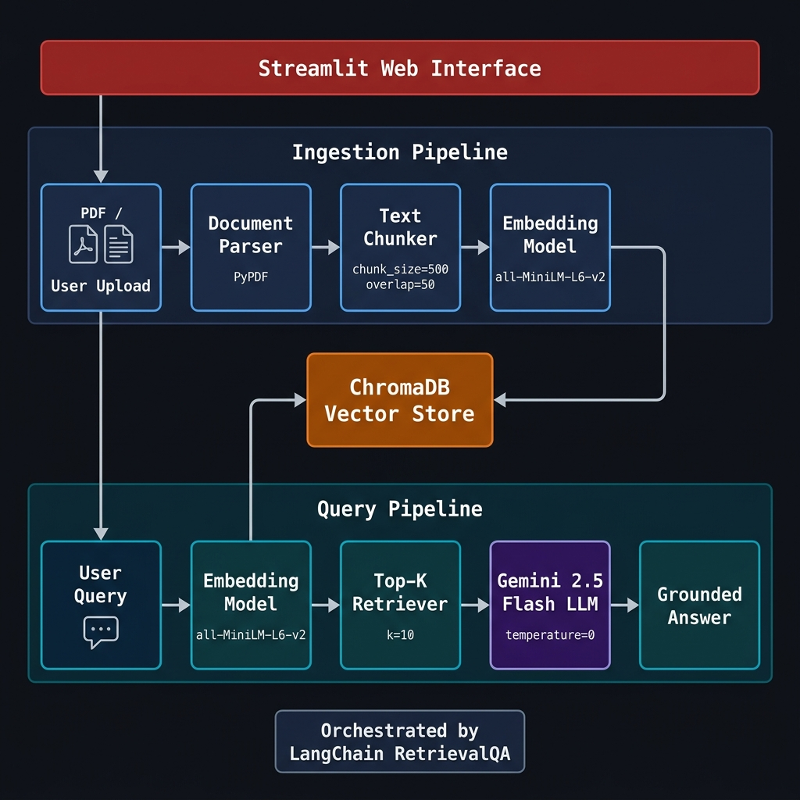

# DocuMind AI
> Secure AI-powered document analysis and retrieval system


## Overview

DocuMind AI is a Retrieval-Augmented Generation (RAG) application that enables users to upload PDF and text documents for natural language querying. The system addresses LLM hallucination by restricting answers strictly to the semantic context retrieved from the uploaded documents. Designed for developers, AI/ML learners, and recruiters, the application demonstrates production-ready integration of local vector storage and dynamic chunk retrieval.

## Demo


*A demonstration of DocuMind AI processing documents and retrieving precise answers with source chunk transparency.*

## How It Works — Architecture



1. **Upload**: Users provide PDF or TXT files via the Streamlit interface.
2. **Parse**: The application extracts raw text content from the uploaded documents.
3. **Chunk**: The text is split into segments (chunk size 500, overlap 50) to maintain context boundaries.
4. **Embed**: Chunks are converted into dense vector representations.
5. **Store**: Vectors are indexed in a local, ephemeral ChromaDB instance.
6. **Retrieve**: The user's query is embedded, and the system retrieves the top-k (3) most similar document chunks.
7. **Answer**: The retrieved context and query are passed to the LLM (temperature 0) to generate a grounded response.

## Tech Stack

| Component | Technology | Purpose |
|-----------|-----------|---------|
| UI | Streamlit | Provides the reactive web interface and chat history |
| LLM | Google Gemini 2.5 Flash | Primary inference engine for answer synthesis |
| Embeddings (paid) | OpenAI (`text-embedding-ada-002`) | High-dimensional semantic representations |
| Embeddings (free) | `all-MiniLM-L6-v2` | Open-source alternative via `sentence-transformers` |
| Vector DB | ChromaDB | In-memory storage and similarity search execution |
| Orchestration | LangChain | Pipeline assembly and RetrievalQA chain management |
| File Parsing | `PyPDF2` | Extraction of raw text data from document binaries |
| Text Splitting | `RecursiveCharacterTextSplitter` | Semantic document segmentation |
| Environment | `python-dotenv` | Secure management of API keys and configurations |

## Features

- PDF and plain text (.txt) file support
- Semantic search using vector embeddings
- Source chunk transparency (see exactly what the LLM used)
- Free embedding mode via sentence-transformers
- Configurable chunk size, overlap, and retrieval count
- Clean Streamlit UI — no frontend code needed
- Fully local vector storage with ChromaDB
- Google Gemini 2.5 Flash / OpenRouter switchable

## Getting Started

### Prerequisites
- Python 3.9+
- Google API key (or use free sentence-transformers for embeddings)

### Installation

```bash
# 1. Clone the repo
git clone https://github.com/yourusername/documind-ai.git
cd documind-ai

# 2. Create virtual environment
python -m venv venv
source venv/bin/activate  # Windows: venv\Scripts\activate

# 3. Install dependencies
pip install -r requirements.txt

# 4. Set up environment variables
cp .env.example .env
# Add your GOOGLE_API_KEY to .env

# 5. Run the app
streamlit run app.py
```

## Project Structure

```text
documind-ai/
│
├── app.py                  # Streamlit UI — main entry point
├── rag/
│   ├── __init__.py
│   ├── loader.py           # Load & parse PDF/text files
│   ├── chunker.py          # Split text into chunks
│   ├── embedder.py         # Embedding model setup
│   ├── vectorstore.py      # ChromaDB build & similarity search
│   └── chain.py            # LangChain RetrievalQA chain
│
├── requirements.txt
├── .env.example
└── README.md
```

## Configuration

| Parameter | Default | Description |
|-----------|---------|-------------|
| `CHUNK_SIZE` | `500` | Number of characters per text segment |
| `CHUNK_OVERLAP` | `50` | Number of overlapping characters between chunks |
| `TOP_K` | `3` | Maximum number of chunks retrieved per query |
| `MODEL_NAME` | `gemini-2.5-flash` | The LLM used for final synthesis |
| `TEMPERATURE` | `0` | Controls output randomness (0 enforces strict grounding) |
| `EMBEDDING_MODEL` | `all-MiniLM-L6-v2` | The model used to generate vector embeddings |

*Note: To switch from paid embeddings to the free HuggingFace alternative, update the `EMBEDDING_MODEL` variable to `all-MiniLM-L6-v2` and ensure `sentence-transformers` is installed.*

## Limitations & Known Issues

- No persistent memory between sessions
- Large PDFs (100+ pages) may be slow to process
- Answers are only as good as the document quality
- Context window bounds limit the maximum permissible `TOP_K` value

## Roadmap

```markdown
- [x] PDF and TXT file support
- [x] ChromaDB local vector store
- [x] LangChain RetrievalQA chain
- [ ] Multi-file upload support
- [ ] Persistent conversation memory
- [ ] FAISS as alternative vector store
- [ ] Deployment to Streamlit Community Cloud
- [ ] Docker support
- [ ] Support for DOCX and CSV files
```

## Contributing

1. Fork the repo
2. Create a feature branch: `git checkout -b feature/your-feature`
3. Commit: `git commit -m "Add your feature"`
4. Push and open a PR

## License

```text
MIT License — feel free to use, modify, and distribute.
```
See `LICENSE` file for details.

## Acknowledgements

- LangChain documentation and community
- Google API
- ChromaDB team
- Streamlit team
- sentence-transformers (SBERT)
