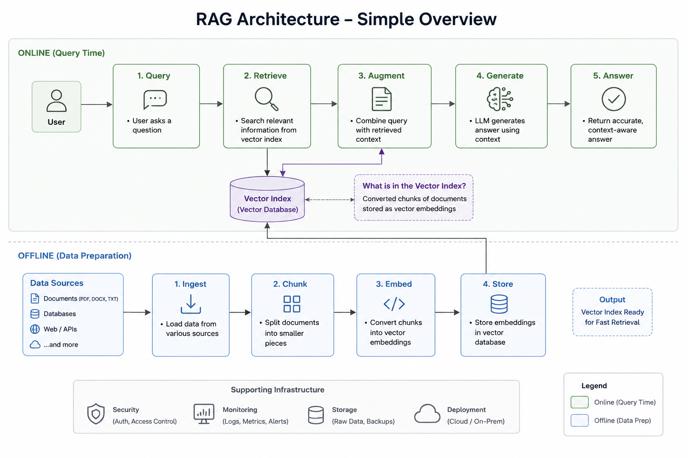

# DocuMind AI

<div align="center">

**AI Study Assistant — powered by RAG, NLP, Gemini, and ChromaDB**

[](https://www.python.org/)
[](https://streamlit.io/)
[](https://langchain.com/)
[](https://ai.google.dev/)
[](https://www.trychroma.com/)
[](https://onnxruntime.ai/)
[](./LICENSE)
[](https://docs.ragas.io/)

</div>

---

## Overview

**DocuMind AI** is an advanced, production-grade **Retrieval-Augmented Generation (RAG)** application optimized to act as an intelligent study assistant. By uploading PDFs or plain-text files, you can query documents in natural language. DocuMind automatically profiles your documents at ingestion time to select optimal chunking and retrieval parameters, uses hybrid semantic/keyword search, reranks candidate passages locally, and synthesizes grounded, fact-checked answers via Gemini.

### Why DocuMind AI?

Traditional RAG pipelines suffer from information loss (due to model sequence length limits) and poor precision (due to noisy retrieved contexts). DocuMind AI implements advanced NLP design patterns to tackle these:

- **Smart Ingestion (Token-Optimized & Parent-Child):** Segmenting documents dynamically into parent contexts (retaining flow) and child chunks (exact semantic vectors), resolving child matches back to full parent passages.
- **Dynamic Auto-Tuning:** Profiles documents at ingestion time (slides, short files, large books) and automatically adjusts RAG parameters (strategy, chunk sizes, Top-K, expansion, and reranking).
- **Hybrid Semantic & Keyword Search:** Fusing Chroma dense vectors with BM25 keywords via Weighted Reciprocal Rank Fusion (RRF) to capture both conceptual matches and exact terms (formulas, definitions).
- **Local ONNX Cross-Encoder Reranking:** Re-scoring and ranking retrieved parent passages using FlashRank on CPU to send only the absolute best contexts to the LLM.
- **Query Expansion:** Formulating multiple question variations (Multi-Query) or generating hypothetical answers (HyDE) via Gemini to query the databases from multiple search angles.

---

## Architecture & Pipeline




### Step-by-Step Process

| Step | Module | Description |
|------|--------|-------------|
| **1. Ingestion Analysis** | `app.py` | Profiles documents by size/page counts to auto-tune ingestion and retrieval configurations (slides deck vs short vs standard vs large). |
| **2. Document Parsing** | `rag/loader.py` | Text is extracted from PDF and TXT binaries using `PyPDF`. |
| **3. Smart Chunking** | `rag/chunker.py` | Splits documents by local token counts (model-optimized under 256 tokens) or hierarchically (large parent context chunks containing metadata-linked small child chunks). |
| **4. ONNX Embeddings** | `rag/onnx_embedder.py` | Converts text to 384-dim vectors locally using `all-MiniLM-L6-v2` via ONNX Runtime CPU. |
| **5. Ephemeral Indexing** | `rag/vectorstore.py` | Child chunks are indexed in `ChromaDB` and a local `BM25Retriever` is instantiated. |
| **6. Query Expansion** | `rag/vectorstore.py` | Expands query via Multi-Query (3 variations) or HyDE (Hypothetical Answer) using Gemini. |
| **7. Hybrid Fusion** | `rag/vectorstore.py` | Retrieves candidates for all queries from Chroma and BM25, merging lists using Weighted RRF. |
| **8. Context Reconstruction** | `rag/vectorstore.py` | Reconstructs matching child chunks to parent contexts and de-duplicates them. |
| **9. Cross-Encoder Rerank** | `rag/vectorstore.py` | Reranks parent passages locally using `FlashRank` CPU on the user's original query. |
| **10. Grounded Answer** | `rag/chain.py` | Selects Top-K reranked passages and prompts Gemini 2.5 Flash (temperature=0) to write a grounded answer. |

---

## NLP Techniques & Tech Stack

### NLP Techniques
- **Token-based Splitter:** counting tokens using the local `all-MiniLM-L6-v2` vocabulary to prevent vector model context truncation.
- **Hierarchical Ingestion:** Parent-child text splitting mapping granular search nodes to rich paragraph contexts.
- **Query Rewrite & Expansion:** Multi-Query and HyDE formulations using Gemini.
- **Weighted Reciprocal Rank Fusion (RRF):** Fusing rank scores across semantic and keyword retrieval streams with custom weight parameters.
- **Cross-Encoder Reranking:** Context scoring via MS-MARCO MiniLM cross-encoder.

### Core Tech Stack
- **UI:** Streamlit (clean Corporate Dark-mode interface).
- **LLM:** Google Gemini 2.5 Flash.
- **Vector DB:** ChromaDB (in-process ephemeral collections).
- **Keyword DB:** Rank-BM25.
- **Reranker:** FlashRank (CPU ONNX ms-marco model).
- **Embedding Model:** sentence-transformers/all-MiniLM-L6-v2 via ONNX Runtime.
- **Orchestration:** LangChain.
- **Evaluation:** RAGAS framework.

---

## Getting Started

### Prerequisites
- Python **3.9+**
- A **Google API key** (free tier at [ai.google.dev](https://ai.google.dev/))

### Installation
```bash
# 1. Clone the repository
git clone https://github.com/Prajwallnaik/DocuMind-AI.git
cd DocuMind-AI

# 2. Create and activate virtual environment
python -m venv venv
# On Windows:
venv\Scripts\activate
# On macOS/Linux:
source venv/bin/activate

# 3. Install dependencies
pip install -r requirements.txt
```

### Configuration
Create a `.env` file in the project root:
```env
GOOGLE_API_KEY=your_google_api_key_here
```

### Run the App
```bash
streamlit run app.py
```
Open `http://localhost:8501` to use your dynamic AI study assistant.

---

## Project Structure

```text
DocuMind-AI/
|
+-- app.py                  # Streamlit UI -- main entry point, profiling & chat dashboard
|
+-- rag/                    # Core RAG pipeline package
|   +-- __init__.py
|   +-- loader.py           # Document loading & text extraction (PDF / TXT)
|   +-- chunker.py          # RecursiveCharacterTextSplitter with tokenizer length counting
|   +-- onnx_embedder.py    # ONNX Runtime embedding model (all-MiniLM-L6-v2) & get_embedding_model()
|   +-- vectorstore.py      # ChromaDB creation, BM25 initialization, Weighted RRF & FlashRank reranking
|   +-- chain.py            # LangChain RetrievalQA chain with Gemini 2.5 Flash
|
+-- onnx_model/             # Auto-exported ONNX model files (model.onnx, tokenizer.json)
|
+-- evaluate/               # RAGAS evaluation package
|   +-- __init__.py
|   +-- ragas_eval.py       # Faithfulness, Answer Relevancy & Context Precision evaluation
|
+-- assets/                 # Static assets (architecture diagrams, screenshots)
+-- chroma_db/              # Local ChromaDB persistence directory
+-- requirements.txt        # Python dependencies
+-- .env                    # Environment variables (not committed)
+-- .gitignore
+-- LICENSE
+-- README.md
```

---

## Features

- **Multi-format support** — Upload and query PDF and plain-text (`.txt`) files.
- **Multi-file upload** — Process several documents simultaneously in one session.
- **Automated Document Profiling** — Detects document profiles (Slides Deck, Short Document, Large Volume Document) at ingestion and self-tunes parameter configs dynamically.
- **Smart Ingestion** — Model-aware Token-Optimized splitting and Parent-Child context mappings.
- **Hybrid Retrieval** — Fuses semantic vector search and BM25 keyword search via Reciprocal Rank Fusion (RRF).
- **Query Expansion** — Synthesizes search angles via Gemini Multi-Query and HyDE formulations.
- **FlashRank CPU Reranking** — Evaluates and ranks retrieved contexts locally for optimal LLM context preparation.
- **Source Transparency** — Exposes exactly which parent document contexts informed each answer.
- **Persistent Chat History** — Keeps context across session runs.
- **Minimalist UI/UX** — Under-the-hood parameters management for a distraction-free user experience.

---

## RAG Evaluation

DocuMind AI includes a dedicated **RAG Evaluation** tab powered by [RAGAS](https://docs.ragas.io/) — the standard open-source framework for measuring RAG pipeline quality.

### How to Use

1. Process your documents using the sidebar.
2. Navigate to the **RAG Evaluation** tab.
3. Enter one or more test questions. Optionally provide an expected answer for each.
4. Click **Run Evaluation** — the system will query the pipeline and score each response automatically.

### Metrics

| Metric | Description | Ground Truth Required |
|---|---|---|
| **Faithfulness** | Proportion of claims in the answer that are directly supported by the retrieved context. | No |
| **Answer Relevancy** | Degree to which the generated answer addresses the question asked. | No |
| **Context Precision** | Whether the most relevant retrieved chunks appear at the top of the ranked list. | Yes |

---

## License

This project is licensed under the **MIT License** — you are free to use, modify, and distribute it.

```
MIT License — Copyright (c) 2026 Prajwal Naik
```

See the [LICENSE](./LICENSE) file for full details.
